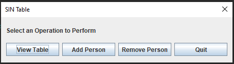

# SIN Table
A Java application that allows storage of names and SIN numbers in a hash table, displayed with Swing. 

## Features
- **Storage**: Users can enter Names and SIN numbers.
- **Removal**: Users can remove entries through the SIN number.
- **Retrieval**: Users can retrieve names from SIN numbers.
- **Input Validation**: The program will validate input and make sure that the SIN numbers are valid.
- **GUI**: The application has a simple GUI with button functionality.

## Developer Details
- The business logic is powered by a hash table, which uses a double hashing function, which uses the extraction method with division using the last 4 digits of the SIN for the first hash code and the extraction method with division on the first 3 digits of the SIN for the second hash function.
- The underlying data structure is a static, dynamically resizable array.
- The GUI was made with Swing.
- Input validation is done with regex.

# Getting Started

## Installing
Install the source files and run in your favorite Java IDE.

## Testing
Tested with ``TestDriver.java`` Manual Unit testing.

## Roadmap / TODO
- The app should save files such that they can be exported as database tables
- Improve security
- Refactor for cleaner code
- Remove static variables
